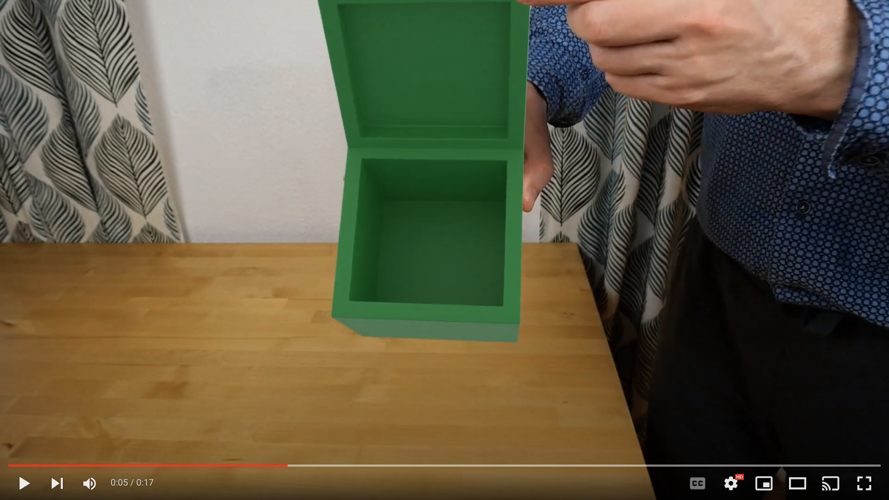

Wooden box
==========

See also [`masking.md`](masking.md) and [`shadows.md`](shadows.md).

Green box: [`track-21-green-box-final.blend`](track-21-green-box-final.blend)

Rotating around an edge
-----------------------

Go into edit mode, select edge select mode, select everything, then unselect and reselect the edge you want to rotate around (such that it becomes the active element).

Select _Active Element_ as the pivot point and (this was the bit, I missed initially) select _Normal_ as the _Transform Orientation_.

Then under the gizmo options, select _Rotate_ and then rotate around whichever axis you want.

Refining for radial distortion
------------------------------

When the camera is fixed and it's an object that's moving, treating things as being the other way around (the camera moving relative to the object) and refining for radial distortion results in extreme results.

I only saw this later when doing a render, the image became _almost_ a circle or something like an old style TV image with the corners pulled in towards the center.

Aligning markers with geometry
------------------------------

I knew exactly how large my box was so unlike e.g. Default Cube in this [video](https://www.youtube.com/watch?v=SbkXb31DrRA&t), I didn't build out my geometry around a mesh created from the tracking markers.

Instead, I created my box with the exact dimensions that I knew it had and _then_ tried to get the markers to line up with this geometry.

I asked this [question](https://blender.stackexchange.com/questions/281039/how-to-align-camera-and-tracked-object-with-existing-geometry) on the Blender SE about how to do this lining up.

For the moment the best solution I could come up with was.

* Use _3D Markers to Mesh_, and screenshotted the camera's view when this mesh was selected (maybe I could have done a render with the vertices of the mesh somehow made visible in the render).
* Then using this screenshot as the background image in the UV workspace, pressed `U` and select _Project from View_ (you don't even need to add seams when using _Project from View_).
* Then in the Shading workspace, I added a new material for the box and added an image texture as input to the color and select the screenshot as the image.
* Then in layout, I select the tracks mesh and parented to the camera (i.e. select tracks mesh, then camera and `ctrl-P`). Then with the pivot set to the 3D cursor (this isn't crucial - it just made scaling easier), I scaled and moved things until the mesh points were exactly on top of the corresponding points on the boxes texture.
* Then I deleted the tracks mesh - it's only purpose was to help get the camera into the right location.
* I added the object solver constraint to the box.

To make vertices visible in a render, try "create an Icosphere to use as the instanced object. Then set the base mesh as the parent of the icosphere. Then on the parent, set Object Properties > Instancing to Vertices. You may also want to enable Align to Vertex Normal." (from [here](https://www.reddit.com/r/blender/comments/jb46dp/show_vertices_in_render/)). There's a very similar answer [here](https://blender.stackexchange.com/a/1831/124535) on the Blender SE.

Update: I found enabling the gizmo on the camera, setting the pivot to it and orientation to local and then dollying it in and out and moving it around before switching the pivot to the 3D cursor and then fine-tuning the line-up got me there the quickest.

Bevel
-----

I had issues with the bevel on the box, I asked about that here:

https://blender.stackexchange.com/questions/281002/bevel-modifier-produces-very-different-miter-to-bevel-tool

In addition to this answer, it's worth nothing:

* Once you've set the _Limit Method_ to _None_, you no longer need to change the _Miter Outer_ to _Patch_ (you can just leave it with the default _Sharp_ value).
* You should tick _Harden Normals_ in the _Shading_ section. Otherwise, you get odd pinching e.g. look at the edges connecting a corner on the outside of the box with the corresponding one on the inside.

Hardened normals is an option on the _Bevel_ modifier - something that does something very similar is the _Weighted Normals_ modifier.

For more details see, e.g.:

* https://www.youtube.com/watch?v=kIupMZgE5qc
* https://www.youtube.com/watch?v=sqGFhiP-2mc
