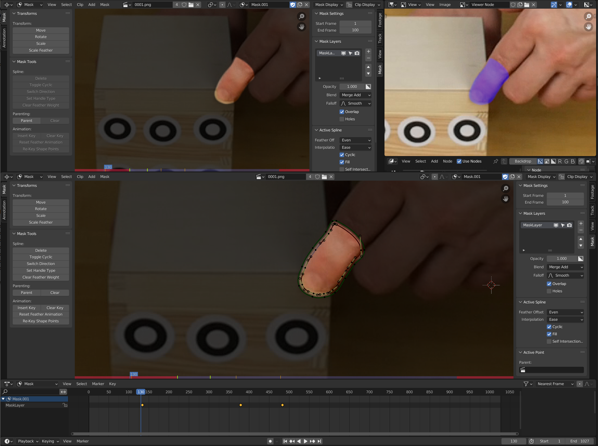
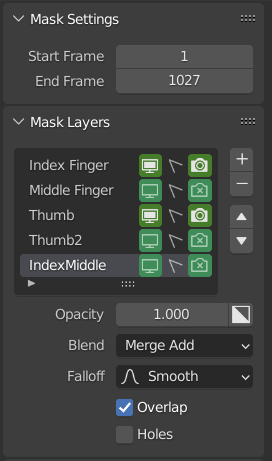
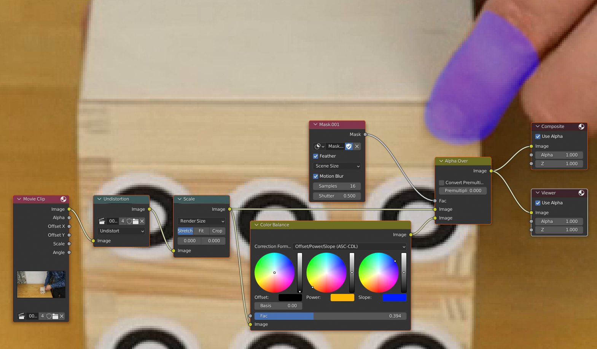
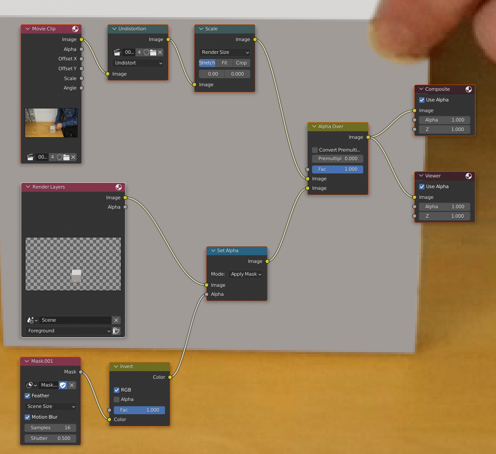
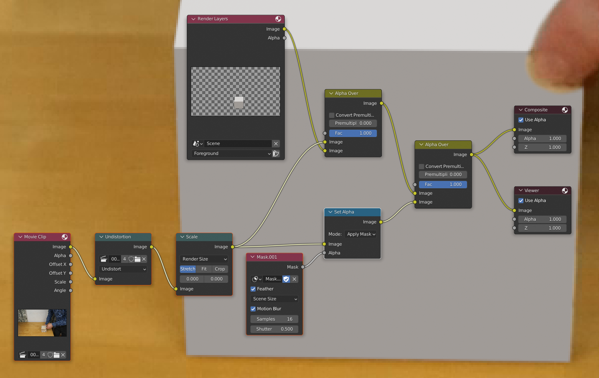

Terminology: from the [documentation](https://docs.blender.org/manual/en/latest/interface/window_system/regions.html) - most editors have:

* A header, i.e. its own menubar.
* A toolbar - this naming seems confusing, it's the tools area to the right that's shown/hidden with `T`.
* A sidebar - the corresponding area to the left that's shown/hidden with `N`.

---

Rotoscoping workspace:

TODO: highlight everything, e.g. the funnel, that's been used to get this exact layout.

---

In tracking workspace, in the main editor, flip from Tracking to Mask and over to the right click New to create a new mask.

Note: there is a default Masking workspace just to the right of the Tracking workspace but it's not set up as described below. So, instead maybe right-click the Tracking workspace, duplicate it and rename it Rotoscoping.

ctrl-LMB to add a point, ctrl-LMB and drag to create a point with handle.

alt-C to close a spline.

DON'T add more points than you really need - remember you're going to have to adjust them over and over for your keyframes.

Go to _Mask Overlay_ and tick _Overlay_ to see the B&W image, then switch _Alpha Channel_ to _Combined_ to see the mask and original image.

Then in the right-hand tools area (n to show/hide), select the Mask tab and e.g. under Settings set the start and end frame for the mask.

Note: having ones mask start and end frame being out of sync with ones video sequence seems to be a common source of lots of issues.

Click and drag the larger center point to move the set of points.

alt-S to adjust the feather - best seen when _Combined_ is on. To flip the feather direction, go to _Mask / Switch Direction_.

FEATHER: Blender Frenzy places his points so the "real" edge in your underlying image is _in-between_ the edge of the spline and the edge of the feather - i.e. the feathered area includes a little of the area outside the "real" edge and the a little inside the "real" edge.

Note: he then goes on to adjust things such that you see none of his greenscreen in the feather - this isn't so easy to achieve with my footage - TODO practice with his greenscreen footage.

Instead of having the feather being part of the mask, one could use a _Dilate/Erode_ node in the compositor.

Press `v` to change the handle type, _Aligned Single_ isn't covered in the [documentation](https://docs.blender.org/manual/en/3.3/modeling/curves/structure.html#handle-types)

* Vector - straight lines.
* Aligned - the handles on either side of the point always stay in a line meaning you always get smooth spline.
* Free - allows you to adjust the handles either side of the point independently so, you can get a sharp corner on one side and a smooth spline on the other.
* Automatic - Blender creates a smooth results (using aligned handles).

_Aligned Single_ seems to be a simpler form of _Aligned_ where you've only got one handle and therefore only one length, so you cannot reduce the length on one side to reduce the area of effect independently of the other side.

So, for an organic shape Aligned may be Aligned maybe appropriate. Otherwise free - particularly useful wherever there's a corner - put the point in the corner and adjust the spline either side of it independently.

You can start with vector and then use `v` to convert to Automatic. Or start with vector and then start dragging individual edges (not the vertices) and the connected vertices will automatically convert to Free.

Note: it doesn't seem to be possible to set the initial handle type - all splines start with vector handles. But immediatelly after adding the first point, you can press `V` and select a handle type for that point and all subsequent points in that spline.

---

When you press `ctrl-C`, you're actually toggling the _Fill_ checkbox in the _Active Spline_ area in the toolbar.

---

You can add multiple splines with a single mask. And you can add completely separate masks (that can have e.g. different start and end frames) by using the field that initially displayed _New_.

But you can also go to the right-hand tool area and rename the thing currently called "MaskLayer" to e.g. "finger" and click the plus button to add another layer.

The _Blend_ dropdown determines how a layer is combined with the layer above - the default is that they're added together but you might want one layer to cut a hole in the layer above - in which case, you'd set _Blend_ to _Merge Subtract_.

As you can add different splines in a single layer, the only point of multiple layers seems to be if you want to use _Blend_ to affect how the splines combine (or want to have different values for one or more of the other layer specific settings, i.e. _Opacity_, _Falloff_, _Overlap_ or _Holes_).

Update: using different layers also means you can also use the little icons to the right of the layer names to e.g. exclude points in the layer from being selected or to hide the layer from the view or render.

Note: if you toggle the invert button for a layer, you'll probably have to either re-order the other layers or change their _Blend_ settings such that the layers all combine again in the fashion you want.

Note: if you've got _Merge Subtract_ set then all splines in this layer will appear to be empty and have no effect unless they overlap a filled spline in another layer.

---

An alternative to manually moving the spline is to use tracking and track a point at the center of the area that you want the spline to follow and then parent the spline to that point. Blender Frenzy does this very successfully for a lapel-mic - it doesn't change shape over the frames, it just changes position.

---

When Blender Frenzy creates a mask for himself (wearing a v-neck t-shirt and waving), he creates one spline for the t-shirt and even though his neck permanently obscures part of the t-shirt and his arm occassionally obscures part of it, he creates a mask for the complete t-shirt and doesn't take his neck or arm into account (which means he sometimes guesses where e.g. parts of the sleave are). Then he creates two additional layers - one for his neck and one for his arm and subtracts these from the t-shirt layer.

Other tutorials suggest the same approach, i.e. treat things as a unit and take other elements into account by creating additional splines that you either combine or subtract.

---

Sometimes, Blender Frenzy starts with a circle and then works from there (lining the circle up with the thing of interest, scaling it and then adding additional points as needed with ctrl-LMB).

To add a circle:

* Click `ctrl-RMB` to place the 3D cursor at the point where you want to add the circle.
* Press `shift-A` to add a circle (or a square).

---

Selection seems a little odd initially with masks. However, just look under the _Select_ menu for all the options you have for selecting things, e.g. `ctrl-L` to select linked or `ctrl-numpad-+` to select more. `AA` or `alt-A` to unselect everything is important as clicking away doesn't do this.

---

If I want to cut holes in my 3D render layer so that bits of the underlying video show thru where they'd otherwise be blocked out by my 3D geomeytry...

Add a Mask node and connect it to an Invert node and combine its with the Render Layers node with a _Set Alpha_ node.
Note: the _Feather_ on the Mask node isn't an additional feather - it turns on and off whether the feather information in you mask is used or not.

Note: the mask is just black and white, i.e. its not an alpha channel, so in your Invert node you just want _RGB_ ticked (the default).

IMPORTANT: there's a _Motion Blur_ toggle on the Mask node - I wonder if one should use this (in addition to applying motion blur to ones 3D geometry).

IMPORTANT 2: enabling the _Motion Blur_ toggle while moving the masking handles and watching the results in a compositing view (as in my rotoscoping setup described above) results in very confusing results - the motion blur takes the future position of the points on the spline into account and results in the mask being applied quite differently to how you expect going thru things a frame at a time.

---

Update:

* Avoid the Invert node, by simply going to wherever you're creating the mask, going to the right-hand tools area and clicking the square (that's split into B&W halves down its diagonal) that makes up the right-hand side of the _Opacity_ field. 
* While you're at it, switch the upper-left editor to Movie Clip, set it up like the main editor to display the mask but under Mask Display, set it to _Alpha Channel_ so you can see the pure mask.
* Hmm... this means that the area within your spline becomes darkened rather than the area outside - maybe that is or isn't an issue.

Update 2: if you invert your mask it can become a little difficult to create your mask as it becomes dark _within_ your splines.

Update: Blender Frenzy goes thru a very complex setup to get real-time display of his mask _without the spline and handles getting in the way_. This is now easy - just go to _Mask Display_ and untick _Spline_.

Note: it's a little confusing - there's an opacity in the right-hand tools area - when it's at 1.0 then white is at its max, i.e. the non-feathered parts of your mask that are white will be maximally _transparent_. Then under _Mask Display_, there's also opacity but this is just a display setting and it affects how much of the underlying image you can see thru the black parts of the mask - crank this value up to 1.0 to make black maximally _opaque_.

For the future: at the moment, I've just left the upper-right editor as the 3D Viewport. It would be nice to have the [real-time compositor](https://code.blender.org/2022/07/real-time-compositor/) there but this is still an experimental feature and while it supports many nodes, it seems to be leaving masking to last (see the _Supported Nodes_ section of the [tracking issue](https://developer.blender.org/T99210)).

Update 2: actually, Blender Frenzy's idea is kind of cool - change the 3D Viewport to the Image editor, in the image dropdown (center of titlebar), select the _Viewer Node_, then vertically split the bottom of the editor and change the bottom of the split to the Compositor and then minimize it to just its titlebar (without the Compositor being present the Image editor doesn't update instantly to reflect your changes).

Note: the current Compositor won't update Render nodes in realtime but lots of other things do (so, perhaps the experimental compositor's real-win is mainly addinG render layers to the mix). So disconnect the render node and:

* Plug the Movie Clip image output (or its output after having been passed thru Undistortion and Scale if present) into _both_ the Image inputs of the main _Alpha Over_ node.
* Plug the Mask not into that _Alpha Over_ node's _Fac_ input.
* Add in a _Color Balance_ node, flip its format to _Offset/Power_Slope_, and drag it so its connected in to adjust the input to the lower _Image_ input.
* Set _Slope_ to blue and _Power_ to yellow (i.e. their values should be opposite each other on a diagonal).
* Redude the _Offset/Power_Slope_ node's _Fac_ value to reduce the opacity.

So, in the left _Movie Clip_ editor you can see if your cutting too far into the surrounding space and in the right _Image_ editor you can see if you're cutting too far into the inner space as you make adjustments.

---

If you're in the tracking workspace and want to start adding keyframes, switch from Movie Clip to Dopesheet in the bottom editor (actually, the Timeline editor is really the bottom-most editor but you just see its titlebar with the play controls).

And switch the mode from Dopesheet to Mask.

Note: it's a bit confusing but Dopesheet is a view you can switch to in the Movie Clip editor - we don't want that, we want the full-blown Dopesheet editor and then Mask mode.

If you go to the little funnel icon, you can unclick _Summary_ so you don't see your keyframes duplicated in a summary line as well as in the mask line.

IMPORTANT: `i` will only insert a keyframe for selected points of your mask so make sure they're _all_ selected.

---

Try auto-keyframing - but remember everyone says they forget to turn it off and this results in hell.

---

CHOOSING GOOD KEYFRAMES: Blender Frenzy says rather than adding keyframes e.g. every 20th frame, find the extremes of motion, e.g. if your hand moves back and forward, find the frames on which its most to the right and most to the left.

Keyframes store feather information - so, if you adjust your feather go to the left-hand tools area (t to show/hide) and click _Reset Feather Animation_.

And if you adjust a point on your mask, adjust the point, press i to update/replace the current keyframe, then (with mouse in the Dopesheet editor) press `a` to select everything but then unselect the keyframe you just updated and click _Re-Key Shape Points_ in left-hand tools area to update all the other keyframes.

---

I didn't find a way to start a new spline other than pressing `aa` to unselect everything to do with the current spline.

You have to press `b` to start a box select.

Animate mask visibility
-----------------------

Rather than creating a new mask with different start and end frames, Blender Frenzy keyframes the first frame on which a spline is needed, then moves to frame zero and moves the spline out of the camera area, keyframes it there and then duplicates that keyframe and drags the duplicate to the frame before the one on which the spline is required.

However, I guess if you turned on motion blur (see Mask node above) then this very sudden movement (from offscreen to where a spline is needed) might affect the motion blur in an undesireable way.

I think a better solution is to animate when a spline is visible. You can do this via the buttons to left of the layer names.

It's least confusing to toggle all three buttons, i.e. toggle the viewport, selection and render, together. And then keyframe the new state by hovering over each button in turn and pressing `i` to keyframe that new state.

Update: actually, it's best not to keyframe selection for a layer. Instead, things are easier if you just make sure selection is disabled for all layers other than the one you're currently working on - this avoids accidentally selecting and keyframing other splines on other layers when you e.g. select everything with `a`. Using `ctrl-L` is a safer alternative to `a` for ensuring you just select all the points of the current spline.

Note: if the viewport toggle is set to off for a layer then it is also unselectable (even if its render toggle is still on).

Tutorials
---------

* Blender Frenzy's [Rotoscoping Guide for Video](https://www.youtube.com/watch?v=hVmJcRccvPk) (this is part 6 of a 8 part series - the [playlist](https://www.youtube.com/playlist?list=PLH3QvbpQe8WTbRFlKKWBwgJuTsZf58tXz) includes some fairly random stuff after part 6).
* CG Cookie's [Rotoscoping Tips in Blender](https://www.youtube.com/watch?v=1eQst8SAVRE).

The CG Cookie video doesn't add much on top of what's covered in Blender Frenzy's videos but he does cover light wrapping at the [7m 5s](https://www.youtube.com/watch?v=1eQst8SAVRE&t=425s) mark.

Screenshots
-----------

Rotoscoping layout:  

Two approaches to applying the mask...

**1.** Cutting a hole in the render layer to show the underlying movie clip.

**2.** Using the movie clip twice with the render layer sandwiched between - the mask is used to cut everything out of the overlying movie clip except the bit that should appear over the render layer.

