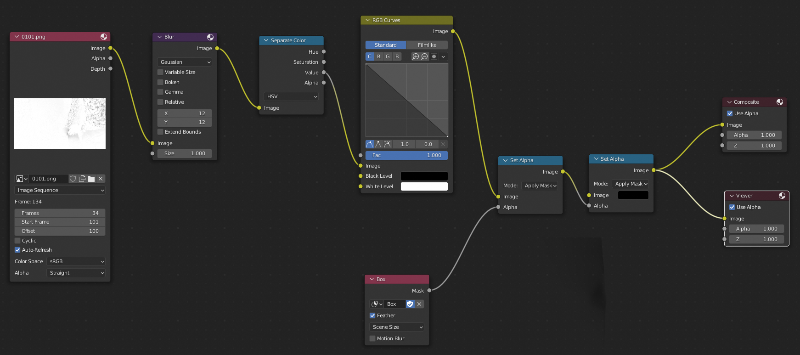
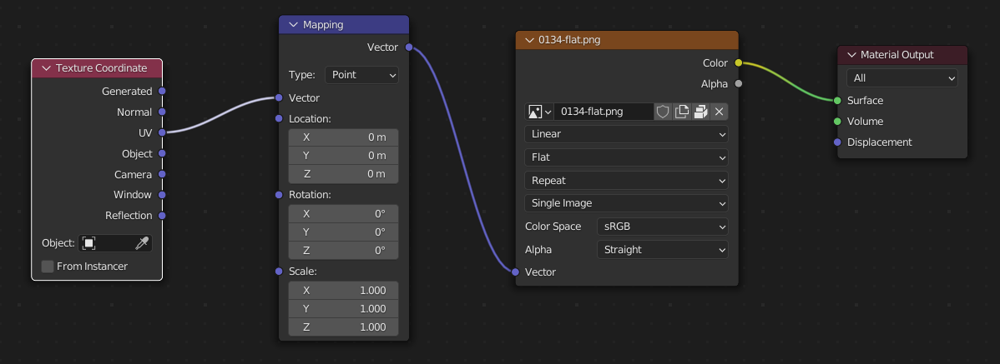
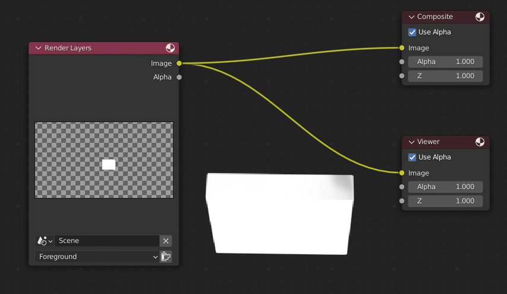
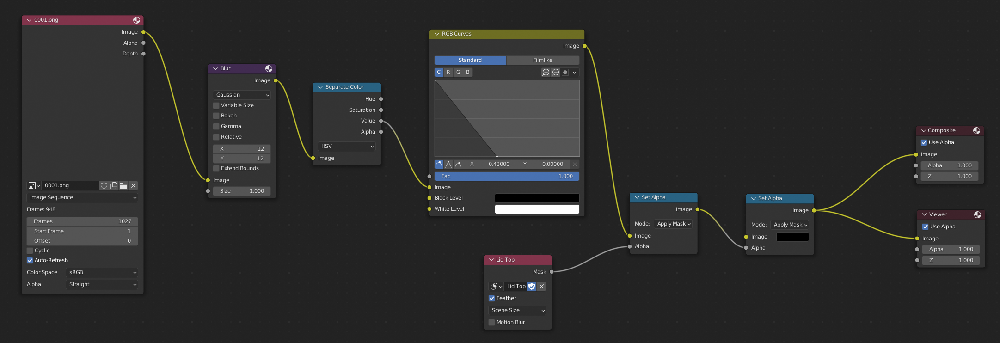
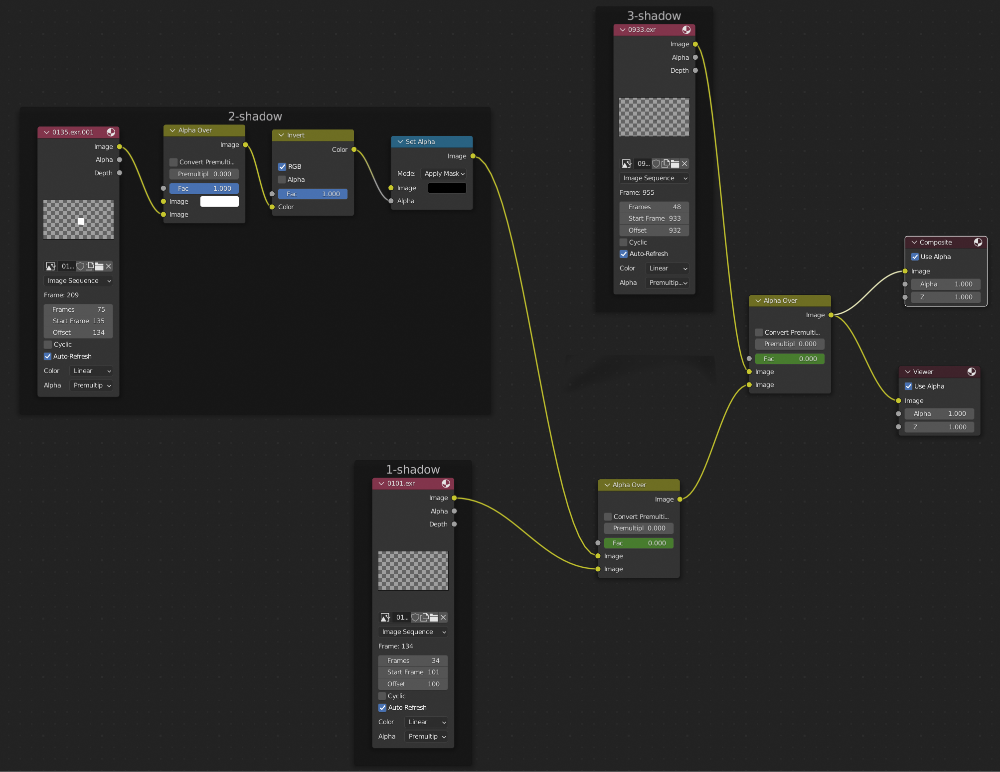

Shadows
=======

Recovering the shadows proved very time consuming.

I used three different approaches.

Important: note that the _Start Frame_ value has been set in many of the _Image_ input nodes below to ensure that sub-ranges of images start playing at the appropriate frame.

Start shadow
-----

I used a reference image - `0100.png` - and wrote a Python script to find the areas that were darker in subsequent images:

```
$ source venv/bin/activate
$ python align_images.py --template movies/clips/0001-1027/0100.png --output=renders/shadow-early-python movies/clips/0001-1027/01[0123]?.png
$ cd renders/shadow-early-python
$ rm 013[56789].png
$ rm 0100.png
```

Then, with [`shadow-early-2.blend`](shadow-early-2.blend), I converted this to EXRs with alpha.



Middle shadow
------

I rendered out the last frame of the start, where things were still static, as a PNG - `0134.png` - and flattened it in GIMP.

You can use textures with alpha with Blender, but then you will see bits of the object through the object itself which isn't what I wanted with the lid.

Then in [`shadow-early-moving.blend`](shadow-early-moving.blend), I disabled everything, except the lid, for rendering and unwrapped it with _Project from View_.

When unwrapping, I moved everything except the front and top faces of the lid to an area of the frame/texture that was all white.

I plugged the flattened PNG straight in as the lid material:



Then, I simply rendered this out with no fancy compositing:



End shadow
---

Lifting the hand from the box at the end was done with [`track-20-top-shadow-final2.blend`](track-20-top-shadow-final2.blend).

I masked out the top of the box and essentially extracted the shadows there with an _RGB Curves_ node.



Combined
--------

Then, I combined the three sections of shadows in [`shadows-combined.blend`](shadows-combined.blend).



Note that the _Fac_ values of the _Alpha Over_ nodes have been keyframed so that the last frame of the lower input disappears rather than staying around once its range of frames is finished.